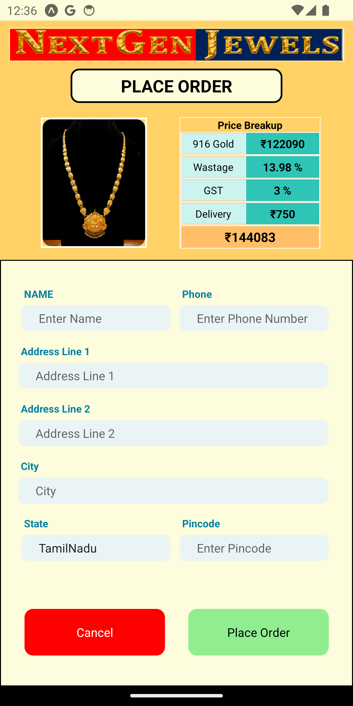
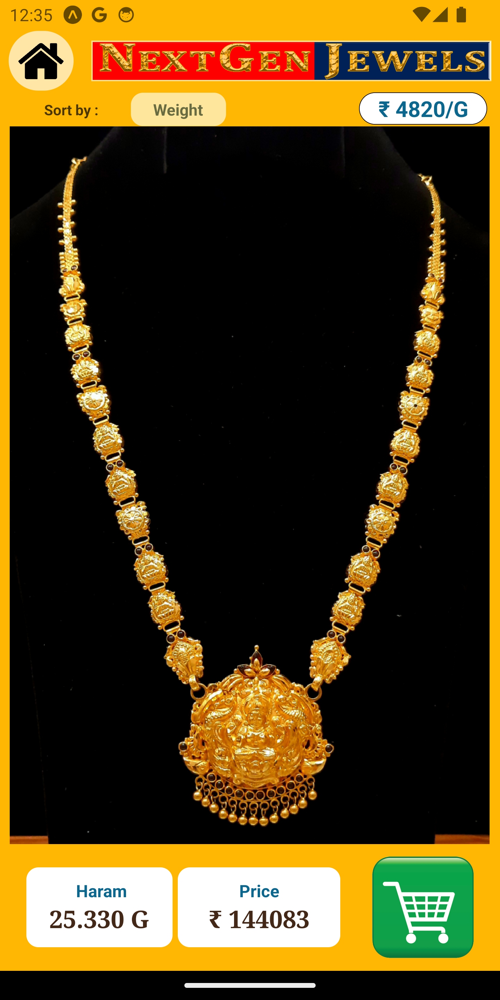
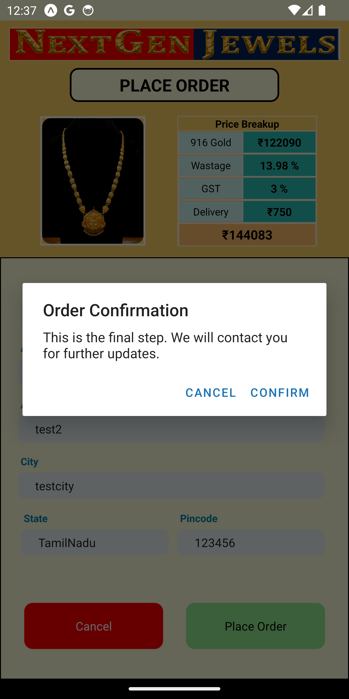
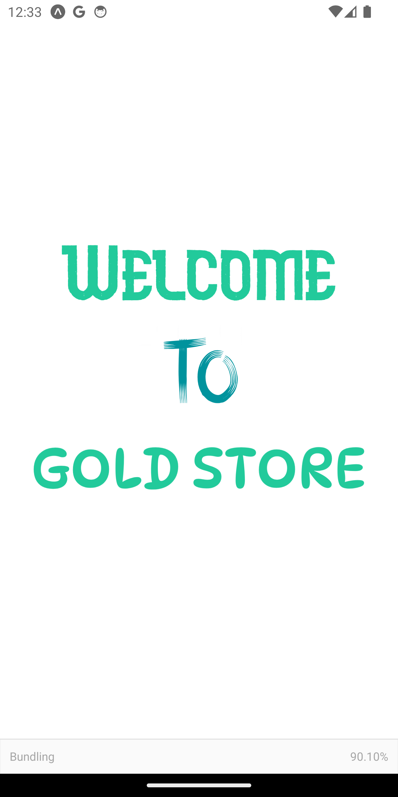

# Gold Store

Gold Store is a full stack application that allows users to view the current gold price, explore various gold models, check their availability, and make bookings. The app is built using React Native for the front-end and Firebase for the back-end.

## Features

- **Live Gold Price:** Stay up-to-date with the current gold price.
- **Gold Models:** Browse through a wide range of gold models available.
- **Availability Check:** Check the availability of desired gold models.
- **Booking System:** Make secure bookings for your preferred gold models.

## Screenshots

Here are some screenshots of the Gold Store app:

### Home Screen

### Gold Details

### Gold Models

### Order Confirmation

### Splash Screen

## Technologies Used

- **Front-end:** React Native
- **Back-end:** Firebase
- **Deployment:** TBD (e.g., Google Play Store, App Store)

## Installation

To run the Gold Store app locally, follow these steps:

1. Clone the repository: